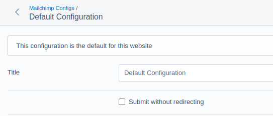
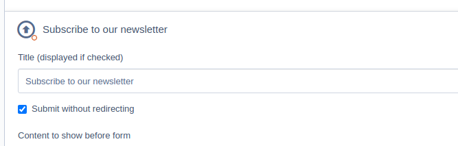

# Documentation

Further documentation will be added here (or open a PR to contribute it)

## Contents

+ Submitting without a redirect
+ Using multiple forms for the same Mailchimp audience ID

## Submitting without a redirect

### Developers

By default, the global form will submit without a redirect.

The global form is one added to your template via the `$ChimpleGlobalSubscribeForm` template variable. It will use the `use_xhr` setting specified in config.yml:

+ true: submit using XHR
+ false: submit with a redirect
+ null: let the checkbox value for the Default configuration record in the administration area decide

## Content authors and administrators

If you have access to the Mailchimp Configuration admninistration are, checking the `Submit without redirecting` checkbox will cause the form for that configuration to submit without redirect.

If you are a content author, you can select a Mailchimp Configuration and optionally override it's setting using the content element's `Submit without redirecting` option

## Adding multiple forms for the same audience

You can add multiple forms for the same Mailchimp audience ID by creating one configuration for each copy you need. Set the `Code` value for each copy to be unique and represent what the form does or the context that it has.

Each configuration will be given a random code on save, if non is provided.

The `Code` value is used in HTML, so putting identifiable text in it is not advised.
